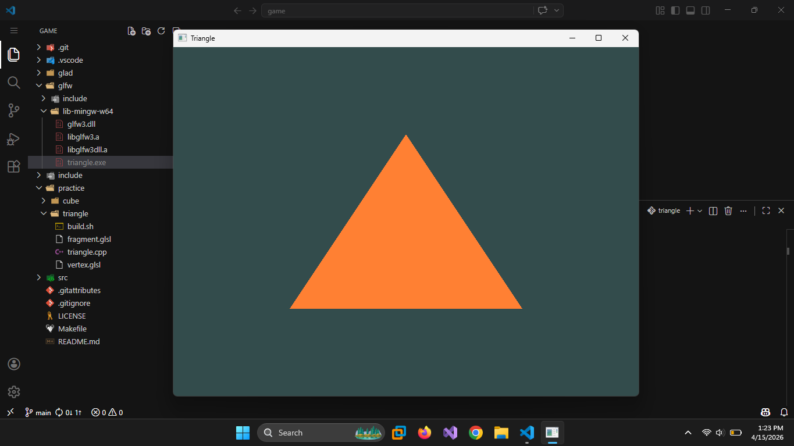
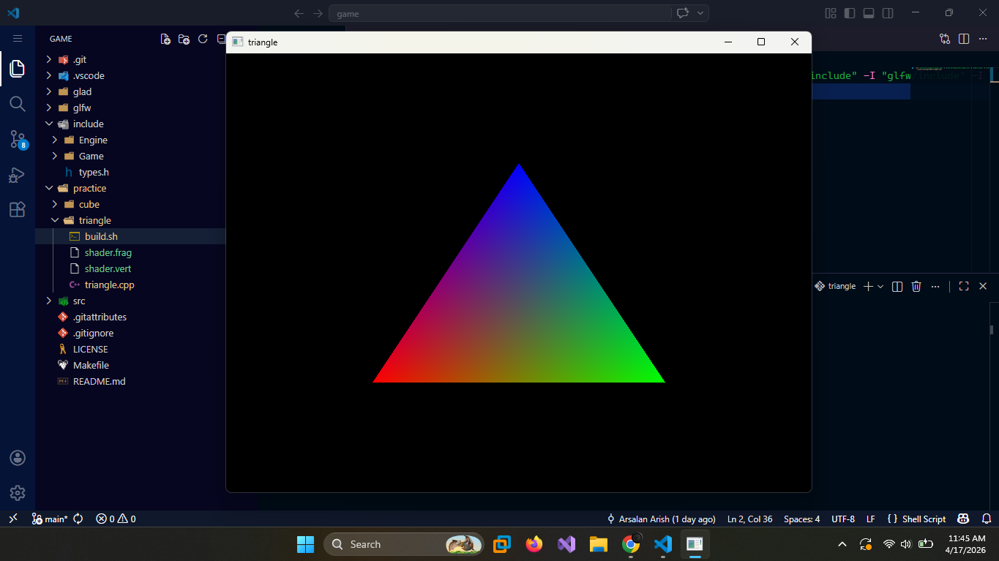

# Game

For windowing and input handling, I will not use Win32 API as it is too verbose and low-level jargon. I will use cross-platform GLFW, as it is more convenient for all reasons

For Graphics Rendering, I will use OpenGL Graphics API, GPU-based rendering. It is cross-platform.

Other game logic will be written in C++.

# Progress

15th April 2026

17th April 2026

